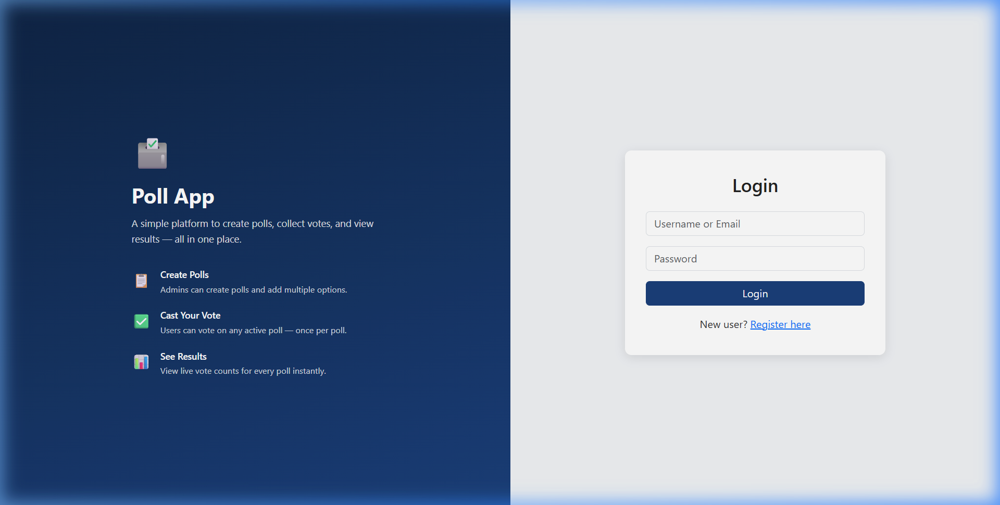
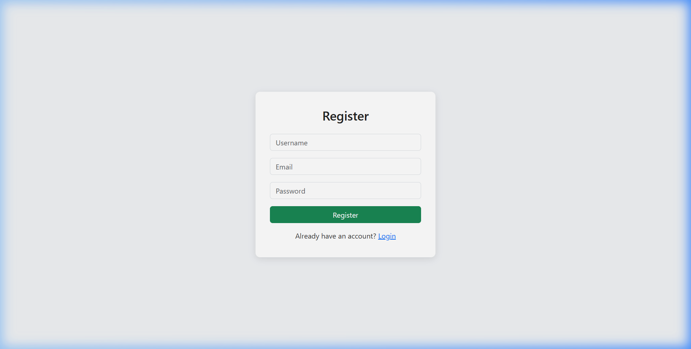
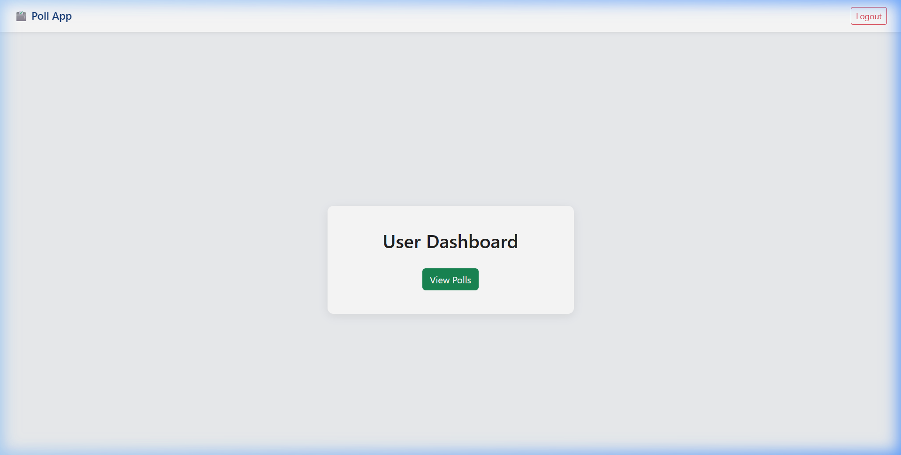
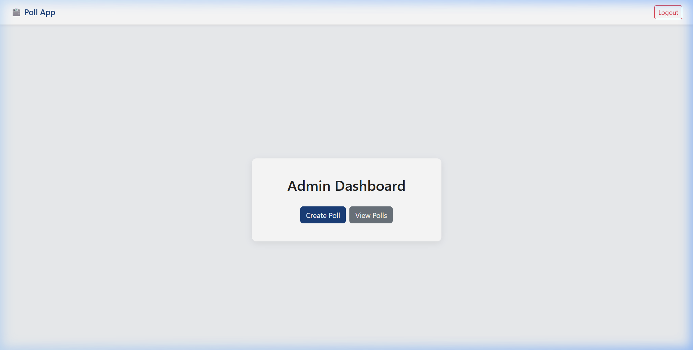
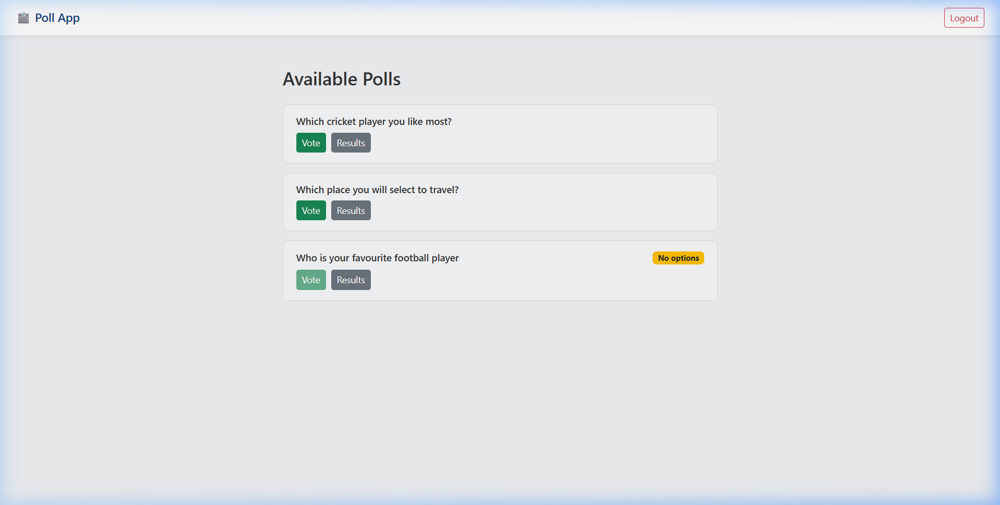
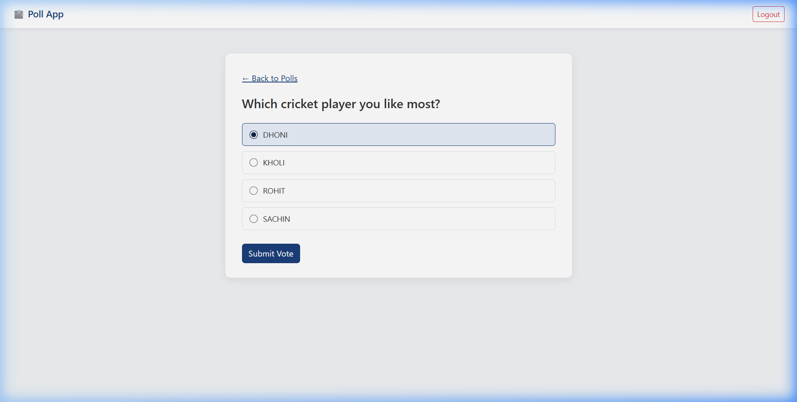
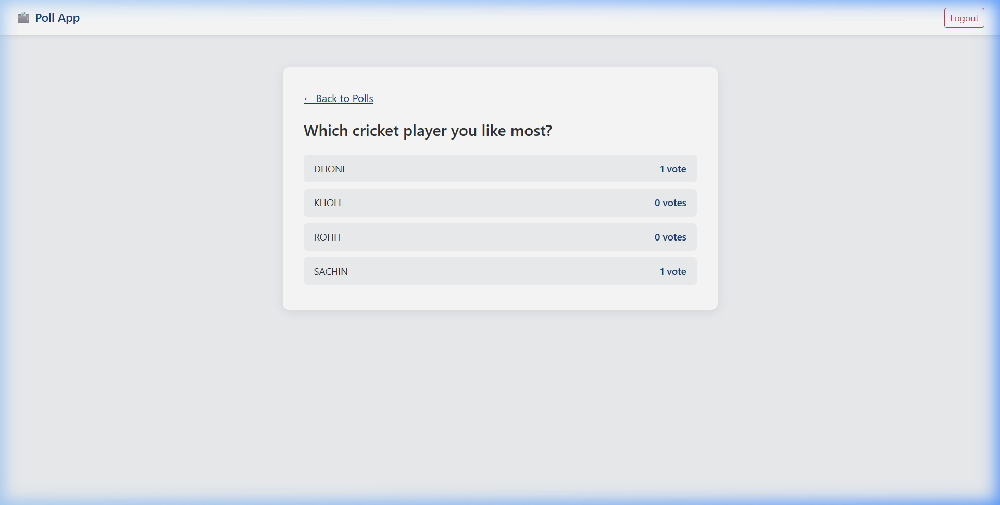
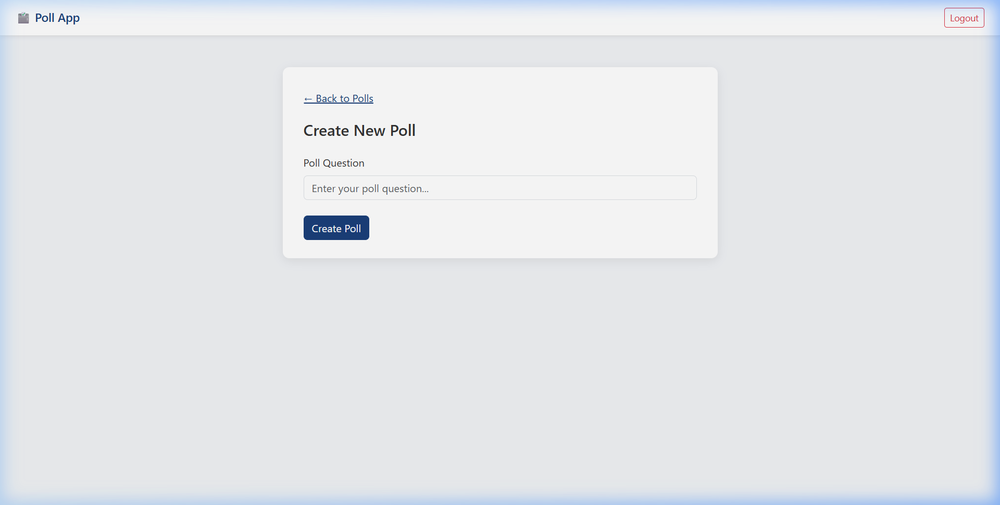

# 🗳️ Web-Based Voting & Polling System


A secure full-stack online voting application that allows authenticated users to participate in polls while ensuring one vote per user using JWT-based authentication.

> ⚠️ This project is available as source code and can be run locally by following the setup instructions below.

---

## 📑 Table of Contents

- [Project Status](#-project-status)
- [Screenshots](#-screenshots)
- [Features](#-features)
- [Tech Stack](#️-tech-stack)
- [Architecture](#️-architecture)
- [Getting Started](#-getting-started)
- [Project Structure](#-project-structure)
- [API Endpoints](#-api-endpoints)
- [My Contribution](#-my-contribution)
- [Future Enhancements](#-future-enhancements)
- [Developer](#-developer)
- [License](#-license)

---

## 🌐 Project Status

| Status | Details |
|--------|---------|
| ✅ Source Code | Available |
| ✅ Functionality | Fully Functional (Local Development) |
| ⏳ Live Deployment | Not Available |

---

## 📸 Screenshots

### 🏠 Home / Login Page


### 📝 Registration


### 🧑‍💼 User Dashboard


### 🛡️ Admin Dashboard


### 📋 Poll List


### 🗳️ Vote Page


### 📊 Results Page


### ➕ Create Poll (Admin)


---

## ✨ Features

### 🔐 Authentication
- JWT Login
- User Registration
- Protected APIs (token-required routes)
- Role-based access (Admin vs User)

### 📋 Poll Management
- Create Poll
- Edit Poll & Choices
- Delete Poll
- View All Polls

### 🗳️ Voting
- One vote per user (enforced at DB level)
- Already-voted detection (upfront check)
- Empty poll guard (Vote button disabled if no choices)
- Live vote results

### 🛡️ Admin
- Manage polls and choices
- Add / update / delete options
- View all poll results

---

## 🛠️ Tech Stack

| Layer | Technology |
|-------|-----------|
| **Frontend** | React, HTML, CSS, JavaScript |
| **Backend** | Python, Django, Django REST Framework |
| **Database** | MySQL |
| **Authentication** | JWT (SimpleJWT) |

---

## 🏗️ Architecture

```
React (Frontend)
      ↓
REST API (Axios)
      ↓
Django REST Framework
      ↓
MySQL Database
```

---

## 🚀 Getting Started

### Prerequisites

- Python 3.10+
- Node.js 18+
- MySQL

### 1. Clone the Repository

```bash
git clone https://github.com/dineshkumarg5/Web-Based-Voting-System.git
cd Web-Based-Voting-System
```

### 2. Backend Setup

```bash
# Create and activate virtual environment
python -m venv venv
venv\Scripts\activate        # Windows
source venv/bin/activate     # Mac/Linux

# Install dependencies
pip install django djangorestframework djangorestframework-simplejwt django-cors-headers mysqlclient

# Configure database
# Edit backend/backend/settings.py → DATABASES section with your MySQL credentials

# Run migrations
cd backend
python manage.py migrate

# Create admin superuser
python manage.py createsuperuser

# Start backend server
python manage.py runserver
```

> Backend runs at: `http://localhost:8000`

### 3. Frontend Setup

```bash
cd frontend
npm install
npm start
```

> Frontend runs at: `http://localhost:3000`

---

## 📁 Project Structure

```
Web-Based-Voting-System/
├── backend/
│   ├── backend/          # Django project settings
│   │   ├── settings.py
│   │   └── urls.py
│   ├── polls/            # Main app
│   │   ├── models.py     # Poll, Choice, Vote models
│   │   ├── views.py      # API views
│   │   ├── serializers.py
│   │   └── urls.py       # API routes
│   └── manage.py
│
├── frontend/
│   └── src/
│       ├── components/
│       │   └── Navbar.js
│       ├── pages/
│       │   ├── Login.js
│       │   ├── Register.js
│       │   ├── AdminDashboard.js
│       │   ├── UserDashboard.js
│       │   ├── Polls.js
│       │   ├── Vote.js
│       │   ├── Results.js
│       │   ├── CreatePoll.js
│       │   ├── AddOptions.js
│       │   └── EditPoll.js
│       ├── services/
│       │   └── api.js    # Axios instance
│       └── App.js
│
├── screenshots/
├── LICENSE
└── README.md
```

---

## 🔌 API Endpoints

| Method | Endpoint | Description | Access |
|--------|----------|-------------|--------|
| POST | `/api/register/` | Register new user | Public |
| POST | `/api/login/` | Login (returns JWT) | Public |
| GET | `/api/polls/` | List all polls | Authenticated |
| POST | `/api/polls/create/` | Create a poll | Admin |
| PUT | `/api/polls/update/<id>/` | Update poll | Admin |
| DELETE | `/api/polls/delete/<id>/` | Delete poll | Admin |
| POST | `/api/polls/add-choice/` | Add choice to poll | Admin |
| PUT | `/api/choices/update/<id>/` | Update a choice | Admin |
| DELETE | `/api/choices/delete/<id>/` | Delete a choice | Admin |
| POST | `/api/polls/vote/` | Cast a vote | Authenticated |
| GET | `/api/polls/<id>/has-voted/` | Check if voted | Authenticated |
| GET | `/api/polls/results/<id>/` | Get poll results | Authenticated |

---

## 👨‍💻 My Contribution

Designed and developed the complete full-stack application including frontend, backend, authentication, REST APIs, database design, and poll management system using React and Django REST Framework.

---

## 🔮 Future Enhancements

- [ ] Email Verification on Registration
- [ ] Election Scheduling (set open/close dates)
- [ ] Real-Time Vote Count (WebSocket)
- [ ] Charts & Analytics (bar/pie charts for results)
- [ ] Candidate Images support
- [ ] Poll Categories / Tags

---

## 👨‍💻 Developer

**Dinesh Kumar G**

- 📧 dinesh369.official@gmail.com
- 🔗 [linkedin.com/in/dineshkumarg5](https://linkedin.com/in/dineshkumarg5)
- 🐙 [github.com/dineshkumarg5](https://github.com/dineshkumarg5)

---

## 📄 License

This project is open source and available under the [MIT License](LICENSE).
